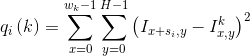
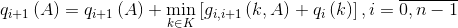

# Character string recognition

## Input
Given an alphabet (`ALPHABET`) random string of given size (`N`) is generated.
Then it is presented as an image.
Font can be specified in variable `font` in `create_letters_images` function in `draw_letters.py` file.
It can be either monospaced or proportional.
It is possible to choose size of font (parameter `SIZE` in `create_letters_images` function).
Then gaussian noise is added to image with given `MU` and `SIGMA` (function `get_noised_image`).

Example of noised image:

## Task
Given noised image of character string, build a graph.
Then use dynamic programming to find sequence of characters that is most similar to the given sequence drawn in noised image.

## Description of used graph
Graph is created in `create_graph.py` file.
Number of object is equal to number of columns in image of string.
Labels are tuples containing name of character and column of its image.
So, there are so many labels as the total width of pictures of all characters in the alphabet.
Example of label: `('A', 0)` is a first column of image of character `'A'`.
In each object there are so much nodes, as the number of labels.
Nodes in each two neighbours are connected with edges.
Edge weight is infinity, if it is not allowed.
Edge weight is zero, if it is allowed.
Weight of a node `(i, k)` is a sum of squared differences between pixels in the column of noised image and column of image of character (because of gaussian noise).

where
- `i` is a number of an object
- `k` is a name of character in this object responding to some character
- `c` is cumber of column in image of character `k`
- `H` is height of image
- `I` is noised image of character sequence
-  is image of a reference character with name `k`

## Dynamic programming solver
Solver based on dynamic programming is implemented in `solver.py` file.

For such part of graph

formula for recomputing weight of node in object `i - 1` with label `k = (' ', 0)` is

where `K` is a set of all labels, `q` is node weight, `g` is edge weight.
The best labels `k'` is saved in node in object `i - 1` with label `k` as the best label in next object.
This should be done for all nodes in all objects.
Weight of the best is then the minimum weight of node in the first object.
As we save the best next label for all nodes, it is possible to find path that gave this weight.

### Results of recognition

## How to use
Open `solver.py`.
In `if __name__ == "__main__"` block change parameter values.
Run `python solve.py` from a directory with project.
