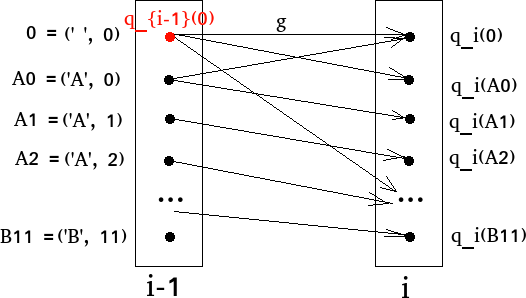
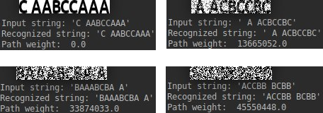

# Character string recognition

## Input
Given an alphabet (`labels`) random string of given size (`n`) is generated.
Then it is presented as an image.
UbuntuMono-B font was used, which is monospaced.
Font can be specified in variable `font` in `create_letters_images` function in `draw_letters.py` file.
It is possible to choose size of font (parameter `size` in `create_letters_images` function).
Then gaussian noise is added to image with given `mu` and `sigma` (function `get_noised_image`).

Example of noised image:

## Task
Given noised image of character string, build a graph.
Then use dynamic programming to find sequence of characters that is most similar to the given sequence drawn in noised image.

## Description of used graph
Graph is created in `create_graph.py` file.
As we know the number of characters in image and all characters has the same width,
one object for one character was used.
In each object there are so much nodes, as the number of characters in alphabet.
Nodes in each two neighbours are connected with edges, edge weights are zero.
So, all objects with nodes is 2d array, containing weights.
Weight of a node `(i, k)` is a sum of squared differences between pixels in the part of noised image and image of character (because of gaussian noise)

where
- `i` is a number of an object
- `k` is a node in this object responding to some character
-  is width of character corresponding to label `k`
- `H` is height of image
- `I` is noised image of character sequence
-  is image of a reference character with label `k`
-  if a shift in horizontal direction, left column of letter with number `i

## Solvers
Two solvers were implemented in `solver.py` file.

### Solver 1. Taking argmin in each object
As all edge weights are zero, all objects are independent.
So, it is correct to take a node in each object that has minimum weight.

### Solver 2. Dynamic programming algorithm
This approach is more general.
There is no need for edges to have zero weights.
For such part of graph

formula for recomputing node weight is

where `n` is number of objects (or number of characters in image).
This should be done for all nodes in all objects.

### Results of recognition

